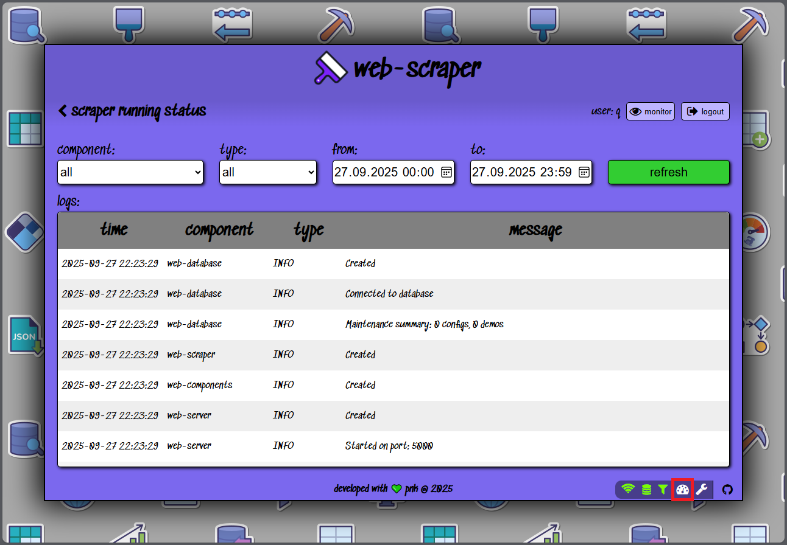

#  web-scraper

A versatile web scraping application built to efficiently gather data from a variety of websites.<br>
This project is ideal for automating data extraction tasks and transforming raw HTML data into structured formats.

### Overview 💡

This service application allows users to specify target websites and define the elements to extract, enabling seamless and customizable public data scraping.
The tool is designed to handle a range of web scraping scenarios, from simple data extraction to complex, multi-page crawling tasks.

### Features 🎨

- <ins>**User-friendly configuration**</ins><br>
  Easily set up scraping tasks through a simple UI or via supported API requests
- <ins>**Customizable scraping rules**</ins><br>
  Users can specify target elements using CSS selectors
- <ins>**Multiple users support**</ins><br>
  Run scraper tasks for several users at once
- <ins>**REST API**</ins><br>
  Output data can be retrieved remotely by sending a request to appropriate REST API endpoint
- <ins>**Error handling**</ins><br>
  Built-in mechanisms to manage failed requests and handle dynamic content

### Requirements 📝

- Node.js 18+ (service - [LINK](https://nodejs.org/en/download))
- MongoDB (data storage - [LINK](https://www.mongodb.com/try/download/community))
- Docker (all-in-one approach - [LINK](https://docs.docker.com/get-started/get-docker/))
- Bruno (API testing - [LINK](https://github.com/usebruno/bruno))

### Installation 📥

It's strongly recommended to use the Docker containers approach for installing and running the web-scraper service.
However if, for whatever reasons, it's not an option then a local installation is also possible and it requires the following steps to be performed:
1. Clone the repository:
   ```
   git clone https://github.com/piopon/web-scraper.git
   ```
2. Navigate to the project directory:
   ```
   cd web-scraper
   ```
3. Install dependencies:
   ```
   npm install
   ```

### Configuration 🔧

Before running the application service create an `.env` file with the following data:
```
# connection parameters
SERVER_PORT=[INTEGER]            # service port number

# database settings
DB_PORT=[INTEGER]                # the port for database connection
DB_NAME=[STRING]                 # the name of the database
DB_ADDRESS=[STRING]              # the IP address for datavase
DB_USER=[STRING]                 # database user (authentication)
DB_PASSWORD=[STRING]             # database password (authentication)

#scraper settings
SCRAP_INACTIVE_DAYS=[INTEGER]    # number of days from last login to treat user as inative
SCRAP_INTERVAL_SEC=[INTEGER]     # default seconds interval between each scrap operation

# internal hash and secrets
ENCRYPT_SALT=[STRING|INTEGER]    # randomize salt value
SESSION_SHA=[STRING]             # hash for session cookie
JWT_SECRET=[STRING]              # hash for JSON Web Token

# external authentication
GOOGLE_CLIENT_ID=[STRING]        # external Google login client ID
GOOGLE_CLIENT_SECRET=[STRING]    # secret for external Google login client

# demo functionality
DEMO_MODE=[ENUM]                 # the demo session mode (duplicate OR overwrite)
DEMO_BASE=[STRING]               # base demo email
DEMO_USER=[STRING]               # user template email
DEMO_PASS=[STRING]               # base demo user password

# CI functionality
CI_USER=[STRING]                 # CI user email
CI_PASS=[STRING]                 # CI user password
```

### Usage 💻

There are two supported ways to run web-scraper service:

* LOCAL

  * Start the MongoDB instance
  * Go to web-scraper directory and use the command:
    ```
    npm run start
    ```
  This will invoke the web-scraper locally on your platform.

* DOCKER

  * Go to web-scraper directory and use the command:
    ```
    docker compose up -d
    ```
  This will invoke the web-scraper in the Docker container in the detached mode (argument `-d`).<br>
  In order to display the logs of the service type the command:
  ```
  docker logs scraper
  ```

2. Open the web-browser and navigate to the configured `IP:PORT` address.<br>
   Login to your account, create a new one, or open a demo session
   
3. Customize your scraping tasks by modifying configuration groups, observers and fill all components data
   
   

   __<ins>After correctly adding first observer your data is now scraped!</ins>__

Current status of web-scraper's components can be quicky checked in the bottom right corner:


After successfull login this panel contains also a link to detailed scraper running status with logs:


Check the `users` directory for scraped data values or error details if configuration is incorrect.

### Project Structure 📊

```
web-scraper/
├── .github/workflows/     # GitHub workflows for CI/CD
├── docs/                  # Requests documentation and docs assets
├── public                 # Frontend UI source files
├── src/                   # Backend UI source files
├── test/                  # Unit tests logic
├── users/                 # Stored scraped data
├── .gitignore             # List of files ignored by GIT
├── CODEOWNERS             # List of code owners
├── LICENSE                # GPL-2.0 license description
├── package-lock.json      # Node.js snapshot of the dependency tree
├── package.json           # Node.js project metadata
└── README.md              # Top-level project description
```

### Contributing 🤝

Contributions are welcome! To contribute:
- Fork the repository.
- Create a new branch for your feature or bugfix.
- Submit a pull request with a clear description of your changes.

### License 📜

This project is licensed under the GPL-2.0 license.
See the [LICENSE](./LICENSE) file for details.

### Contact 💬

For questions or suggestions, feel free to contact me through GitHub or via [email](mailto:piopon.github@gmail.com).

---
<p align="center">Created by PNK with ❤ @ 2023-2025</p>